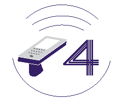
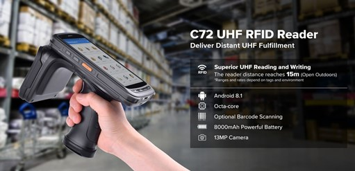
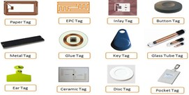
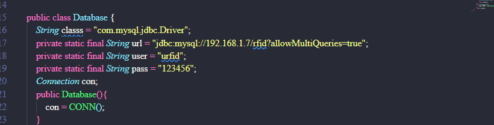

<h1 align="center"> RFID Import Retail</h1>  

  

    Faster and more convenient with RFID Technology

## Table of Contents

- [Table of Contents](#table-of-contents)
- [Introduction](#introduction)
- [Technologies](#technologies)
- [Setup](#setup)
- [Features](#features)
- [Build Process](#build-process)
- [Acknowledgments](#acknowledgments)
- [Evolution](#evolution)
- [Contact](#contact)

## Introduction
- This is a project that applies RFID technology to the product inventory process. My team has helped and supported equipment from the company Beetech has completed the project in a great way.
- RFID is a wave scan technology used in many fields such as Retail, Hospital, Warehouse, Human Resource Management, Security, ETC.In this project, we use the Chainway Reader C72 device used to scan RFID cards and RFID cards (RFID Tags) - a chip + antenna tag.
- RFID tag can replace barcodes on products sold at retail supermarkets. Instead of having to put the device close to the barcode to scan, RFID allows information to be transmitted through small distances without any physical 
## Technologies
- Project create with:
- RFID technology (Chainway Reader C72 + RFID tag)
   - Chainway Reader C72 
   
   - RFID tag 
   - 
- Winform C#
- Devexpress version 21.2
- Android Studio
- MySQL 

## Setup
1. Download and setup Xampp or MySql Workbench
2. Create database name `rfid` and Import sql script  
3. Create user with username `urfid`, password `123456` and check all PRIVILEGES
4. Download and setup Visual Studio 2017 or higher.
[Link Download Visual Studio](https://visualstudio.microsoft.com/downloads/)
5. Download and setup Devexpress [Link Download Devexpress](https://drive.google.com/file/d/1ZBw0yQuZo4KTdcW4Izpe_8IqjOfPrdNO/view?usp=sharing)
6. Install Android Studio Latest Version (Android-STUDIO-2021.1.1 or More)
Link https://developer.android.com/studio?gclsrc=ds&gclsrc=ds
7. Create Emulator virtual machine in Android Studio:
   + Menu Tools -> AVD Manager
   + Create Virtual Device: 
     - Choose Phone (Example Pixel 2) 
     - Choose Next
     - Choose Oreo API Level 27, Android 8.1
8. Change Ip Address In Database.java in RFID.Android
    
## Features
- Product Manage
- Good Receipt Notes Manage
- Mapping Product and RFID
- Import and Export Product, Good Receipt Note
- Export import report
- etc

You can read more analysis document in [[Design Analysis Document](https://drive.google.com/file/d/1RB1nEUCyh1hzJsW3QDAtAwFIqoHnptoB/view?usp=sharing)]

**Review Feature**
- Login Form

- Mapping RFID

- Product List and CRUD

You can read more review user interface in [[Design Analysis Document](https://drive.google.com/file/d/1RB1nEUCyh1hzJsW3QDAtAwFIqoHnptoB/view?usp=sharing)](From page 13)
## Build Process
This is my university subject project. I applied the waterfall process to my team. Some activity in every stage 
1. Requirements analysis
   - We have collected requests from BeeTech Company, then pose problems and analyze them.
2. System design
  With the help of Beetech company [Website BeeTech](https://beetech.com.vn/en/), I have learned about the necessary knowledge of RFID technology.
   - Sticking to the requirements of the import problem:
   Goods for sale to the store have RFID chip
       1. Delivery to warehouse created from Desktop App
       2. The staff when receiving the use of Chainway C72 Reader quickly scan the chips to record the goods to the warehouse
       3. Preview for receiving goods (Differences with delivery orders)
    - During this period, I assigned and supported the group members. I am the decision maker of the functions and professional processes. We have agreed on Lam - a member of the group will compose a report and presentation, and I will make a project.
3. Implementation
   - I chose Winform and Devexpress library for Desktop App. 
   - For the database part, the original database I decided to use Firebase. But in the process of development, my team received a request to use the same database server and Master Data with other team in my class. That's why I changed to MySQL. 
   - For the programming application for Chainway C72 Reader, I chose Android Studio to perform
-  **Assignment table**
  
   |                |                                  Task                                  |                Deadline |
   | :------------- | :-------------------------------------------------------------------- | :---------------------- |
   | Minh Quan (me) | Build MySql, Design Logo, Desktop App, Android Studio for ChainWay C72 | 28/03/2022 - 05/03/2022 |
   | Vi Lam         |            Compose a report  consist of docx and pptx file             | 24/04/2022 - 06/03/2022 |
## Acknowledgments
- Benefits
  - Usability feature
  - Proficient use of Chainway 72 device
  - Mapping is asset information with RFID
  - Update information after each scan
  - Flat Design interface, intuitive, minimalist and easy to use
  - Sticking to the requirements, full functions and processes
  - There are outstanding features like Hot Reload Checking, Option Import Mapping Productrfid

- Drawbacks
    - SQL is still flawed to follow the reality scenario
    - Application has not been optimized due to many excess code parts
    - The interface is not perfect
    - Not to try many machines using the system
## Evolution
- Survey more practical skills to improve software quality
- Web development for updates and management
- Multi -platform, multi -equipment to fit the trend today
- Optimize code and apply additional security measures.
- Build more test scenarios.
## Contact

- ***Phone***: 0909300146
- ***Mail***: npminhquan1506@gmail.com